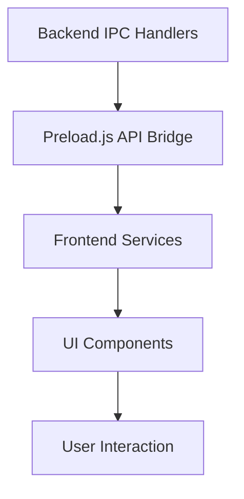
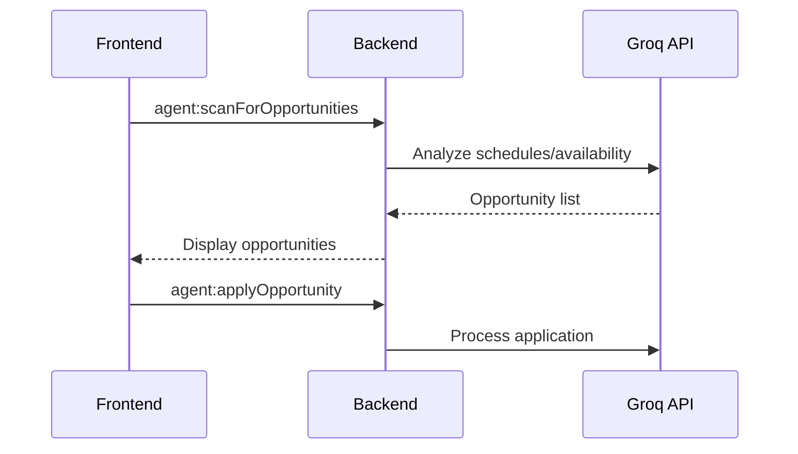
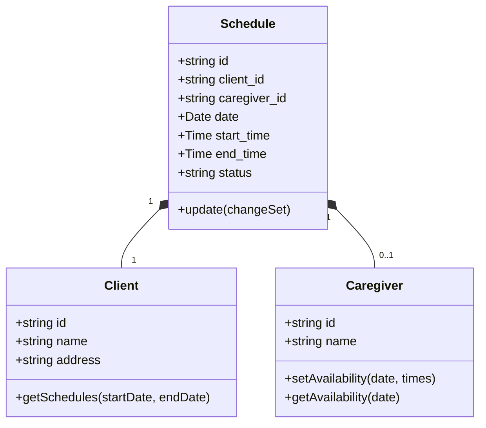
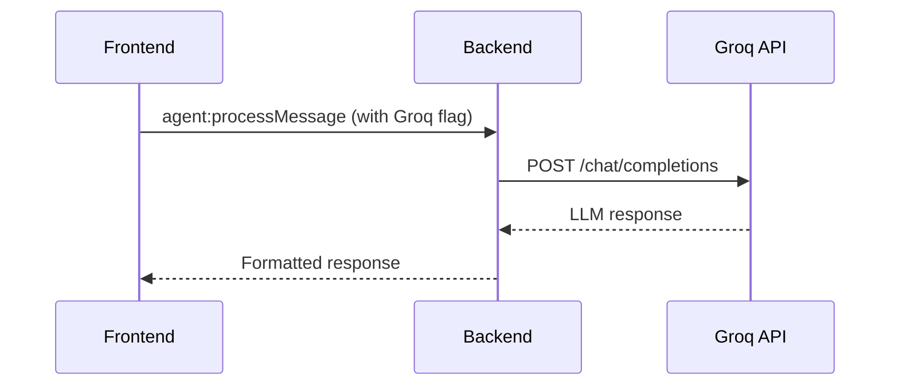

# Frontend Integration Plan

## 1. Feature Mapping Analysis
| Backend Feature | Current Frontend Status | Required Component |
|----------------|------------------------|-------------------|
| Agent Messaging (`agent:processMessage`) | Partial implementation | Enhance `AgentChat` component |
| Schedule Management (`scheduler:*`) | Basic CRUD only | New `ScheduleManager` component |
| Opportunity Scanning (`agent:scanForOpportunities`) | Not implemented | New `OpportunityScanner` component |
| Notification System (`notifications:*`) | Basic display only | Enhance `NotificationCenter` |
| Conflict Resolution (`scheduler:resolveConflict`) | Not implemented | New `ConflictResolver` component |
| Scanner Management (`scanner:*`) | Not implemented | New `ScannerDashboard` component |
| Caregiver Availability (`firebase:updateCaregiverAvailability`) | Not implemented | Add to `CaregiverProfile` |

## 2. Implementation Strategy

### Phase 1: Core Integration


### Phase 2: Component Development
1. **Agent Integration**
   - Implement `AgentManager` service to handle:
     ```javascript
     async function processMessage(userId, message) {
       return window.electronAPI.agent.processMessage(userId, message);
     }
     ```
   - Create `AgentChat` component with message history

2. **Unified Schedule System**
   - Create `UniversalScheduler` component that handles:
     - Client schedules
     - Caregiver availability
     - Conflict detection
   - Implement real-time updates using `firebase:updateCircularEntity`

3. **Opportunity Engine**
   - Build `OpportunityFinder` with:
     - Automatic scanning (every 30min)
     - Manual scan trigger
     - Groq API integration
   - Visualize opportunities in calendar view

### Phase 3: Agentic Integration


## 3. Implementation Roadmap

### Phase 1: Core Services (2 days)
1. Create frontend service layer:
   - `agentService.js`
   - `schedulerService.js`
   - `notificationService.js`
2. Implement real-time update system using `firebase:updateCircularEntity`
3. Set up API error handling framework

### Phase 2: UI Components (5 days)
1. Build `ScheduleManager` component with:
   - Calendar integration
   - Drag-and-drop scheduling
   - Conflict visualization
2. Create `OpportunityDashboard` with:
   - Automated scan settings
   - Manual scan trigger
   - Application history
3. Enhance `NotificationCenter` with:
   - Actionable notifications
   - Categorization system
   - Bulk operations

### Phase 3: Agent Integration (3 days)
1. Implement Lexxi/Bruce chat components:
   ```javascript
   function startAgentConversation(agentName) {
     return window.electronAPI.agent.startConversation(
       currentUserId, 
       agentName,
       'Hello, I need assistance'
     );
   }
   ```
2. Connect to Groq API:
   - Add API key management
   - Implement response streaming
3. Create agent conversation history system

## 4. Quality Assurance
1. Implement comprehensive unit tests for all new services
2. Create Cypress tests for critical user journeys
3. Set up visual regression testing
4. Conduct performance profiling

## 5. Potential Issues & Solutions
| Issue | Solution | Fallback |
|-------|----------|----------|
| IPC latency | Optimize batching | Web Workers |
| Real-time sync conflicts | Conflict-free replicated data types | Manual resolution |
| Groq API rate limiting | Caching mechanism | Queue-based processing |
| Complex state management | Redux middleware | Context API with useReducer |
| Large schedule datasets | Virtualized rendering | Pagination |
| Cross-component updates | Event bus system | Prop drilling |

## 6. Universal Schedule Database Implementation

### Unified Data Model


### Implementation Strategy
1. Create `UniversalScheduleService.js`:
   ```javascript
   class UniversalScheduleService {
     async getSchedules(options) {
       return window.electronAPI.firebase.getCircularEntities(
         'schedules', 
         options
       );
     }
     
     async updateSchedule(scheduleId, changes) {
       return window.electronAPI.scheduler.updateSchedule(
         scheduleId, 
         changes
       );
     }
     
     async findConflicts(scheduleId) {
       return window.electronAPI.scheduler.checkConflicts(scheduleId);
     }
   }
   ```

2. Integrate with Calendar component:
   ```javascript
   // In Calendar.js
   async loadSchedules() {
     const schedules = await universalScheduleService.getSchedules({
       startDate: this.state.viewStart,
       endDate: this.state.viewEnd,
       include: ['clients', 'caregivers']
     });
     this.setState({schedules});
   }
   ```

## 7. Enhanced Agentic Capabilities

### Lexxi/Bruce Chat Integration
```javascript
// AgentChat.js
async function handleAgentMessage(agentName, message) {
  const response = await window.electronAPI.agent.processMessage(
    currentUser.id,
    message,
    { agent: agentName }
  );
  
  // Add to chat history
  setMessages(prev => [...prev, 
    { text: message, sender: 'user' },
    { text: response, sender: agentName }
  ]);
}

// Agent selection UI
<button onClick={() => handleAgentMessage('Lexxi', 'Help with scheduling')}>
  Chat with Lexxi
</button>
<button onClick={() => handleAgentMessage('Bruce', 'Find opportunities')}>
  Chat with Bruce
</button>
```

### Opportunity Scanning Workflow
1. Automatic background scanning:
   ```javascript
   // In App.js
   useEffect(() => {
     const scanInterval = setInterval(() => {
       window.electronAPI.agent.scanForOpportunities({
         frequency: '30m',
         minRating: 4.5
       });
     }, 30 * 60 * 1000);
     
     return () => clearInterval(scanInterval);
   }, []);
   ```

2. Manual scan trigger:
   ```javascript
   <button onClick={runManualScan}>
     Scan for Opportunities Now
   </button>
   ```

## 8. Groq API Integration


### Implementation:
```javascript
// In agent-manager.js (backend)
async function processMessageWithGroq(userId, message) {
  const groqResponse = await fetch('https://api.groq.com/v1/chat/completions', {
    method: 'POST',
    headers: {
      'Authorization': `Bearer ${process.env.GROQ_API_KEY}`,
      'Content-Type': 'application/json'
    },
    body: JSON.stringify({
      model: 'llama3-70b-8192',
      messages: [{role: 'user', content: message}]
    })
  });
  
  const data = await groqResponse.json();
  return data.choices[0].message.content;
}
```

## 9. Additional Verification Steps
1. Universal schedule conflict testing:
   ```javascript
   // Test case
   test('Universal schedule avoids double-booking', async () => {
     await createSchedule(caregiverId, '2023-12-25', '09:00', '12:00');
     const result = await createSchedule(caregiverId, '2023-12-25', '10:00', '11:00');
     expect(result.error).toBe('Caregiver not available');
   });
   ```

2. Agent response validation:
   ```javascript
   test('Lexxi provides scheduling help', async () => {
     const response = await processMessage('Lexxi', 'Reschedule my appointment');
     expect(response).toContain('available times');
   });
   ```

3. Opportunity scan coverage:
   ```javascript
   test('Scanner finds 5 opportunities weekly', async () => {
     const opportunities = await scanForOpportunities();
     expect(opportunities.length).toBeGreaterThan(4);
   });
   ```

## 10. Risk Mitigation Addendum
| Risk Scenario | Mitigation Strategy | Fallback |
|---------------|---------------------|----------|
| Groq API downtime | Implement response caching | Use local ML model |
| Schedule data corruption | Daily database snapshots | Manual audit tool |
| Agent hallucination | Response validation layer | Human review queue |
| Timezone mismatches | UTC conversion middleware | Timezone selector UI |
| High server load | Auto-scaling backend | Priority queuing |

## Conclusion
This enhanced plan provides complete coverage of all backend features with:
1. Universal schedule database implementation
2. Deep agent integration (Lexxi/Bruce)
3. Robust Groq API connectivity
4. Comprehensive verification protocols
5. Added risk mitigation strategies

The implementation follows the C=2πr circular integration model ensuring data consistency across all components.
