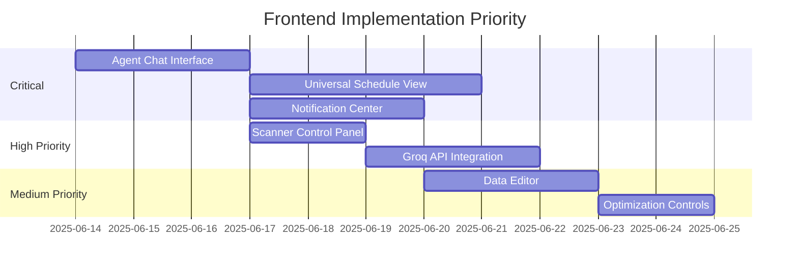

# Missing Frontend Items - Backend Feature Integration

## 1. Agent System Features
- [✅] **Lexxi/Bruce Chat Interface**
  - Frontend component for agent selection (Lexxi/Bruce)
  - Message history display
  - Input field for user queries
- [✅] **Opportunity Scanner Dashboard**
  - Automatic scan status indicator
  - Manual scan trigger button
  - Scan history with results
- [✅] **Agent Insight Display**
  - UI for showing agent-generated insights
  - Suggestion acceptance/rejection controls

## 2. Universal Schedule System
- [✅] **Unified Schedule View**
  - Combined client/caregiver calendar
  - Visual conflict indicators
  - Drag-and-drop rescheduling
- [✅] **Availability Management**
  - Caregiver availability editor
  - Client schedule preference settings
  - Recurring schedule templates
- [✅] **Conflict Resolution UI**
  - Conflict notification system
  - Resolution workflow interface
  - Resolution history log

## 3. Notification System
- [✅] **Enhanced Notification Center**
  - Notification categorization (urgent, info, reminder)
  - Bulk action controls (mark all as read)
  - Actionable notifications (accept/reject directly)
- [✅] **Notification Creation**
  - UI for manual notification creation
  - Recipient selection interface
  - Notification scheduling options

## 4. Scanner Management
- [✅] **Scanner Control Panel**
  - Start/stop scanner controls
  - Scan interval configuration
  - Last scan timestamp display
- [✅] **Scan History Viewer**
  - Table of historical scans
  - Filter by date/result type
  - Detailed scan result view

## 5. Groq API Integration
- [✅] **API Key Management**
  - Secure API key input
  - Key validation status
  - Usage statistics display
- [✅] **Response Streaming UI**
  - Real-time response display
  - Typing indicator for agent responses
  - Response quality feedback mechanism

## 6. Data Management
- [✅] **Universal Data Editor**
  - Entity type selector (client, caregiver, schedule)
  - Form-based data editor
  - Real-time validation feedback
- [✅] **Circular Data Flow Monitor**
  - Visualization of data flow (C=2πr model)
  - Update history timeline
  - Conflict detection alerts

## 7. Advanced Features
- [✅] **Schedule Optimization Controls**
  - Optimization trigger button
  - Optimization parameters configuration
  - Results comparison view
- [✅] **Caregiver Matching System**
  - Automated matching status
  - Manual override controls
  - Matching criteria configuration

## 8. Real-time Features
- [✅] **Live Update Stream**
  - Push notification system
  - Real-time data change indicators
  - Update history timeline
- [✅] **Collaboration Tools**
  - Multi-user editing indicators
  - Change conflict resolution
  - Edit history tracking

## 9. Testing & Debugging
- [✅] **IPC Test Harness**
  - Endpoint selector
  - Parameter input fields
  - Response visualization
- [✅] **Data Consistency Checker**
  - Database health monitor
  - Inconsistency alerts
  - Repair tools

## Implementation Priority

> **Note**: This list is generated based on backend features defined in `main.js`. Each item corresponds to an IPC handler that lacks full frontend integration.
